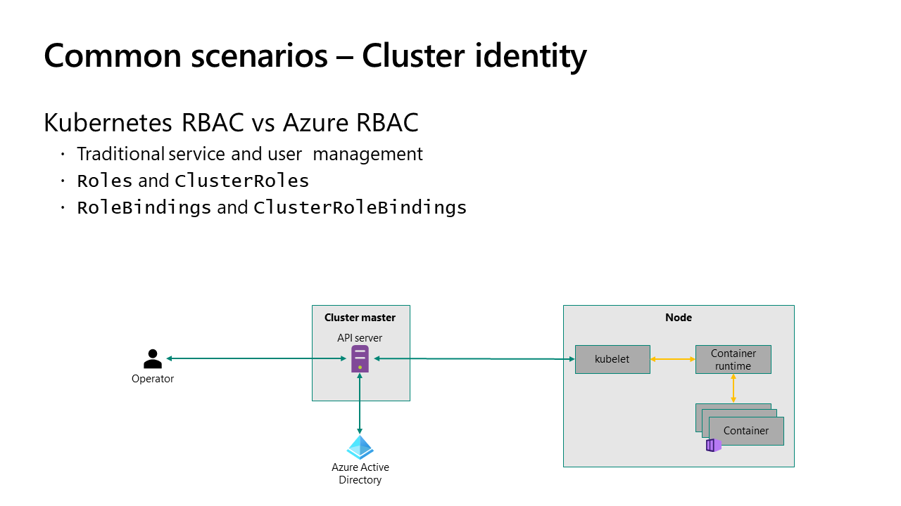
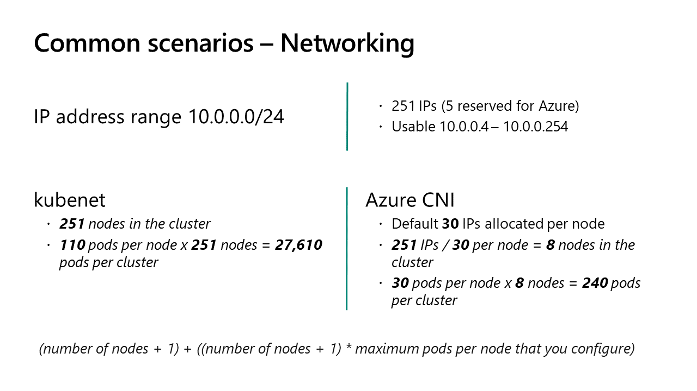
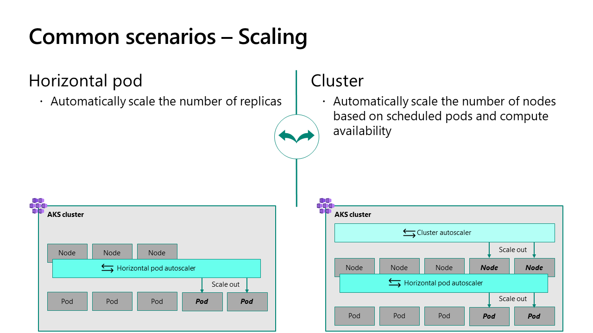
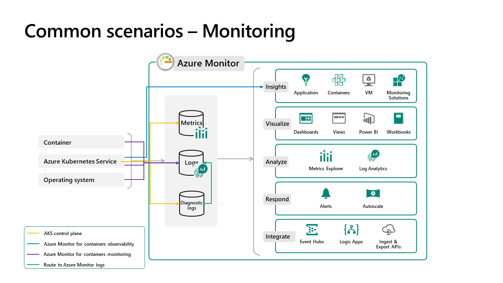

Operationalizing Azure Kubernetes Service

Whiteboard design session trainer guide

May 2020

Information in this document, including URL and other Internet Web site references, is subject to change without notice. Unless otherwise noted, the example companies, organizations, products, domain names, e-mail addresses, logos, people, places, and events depicted herein are fictitious, and no association with any real company, organization, product, domain name, e-mail address, logo, person, place or event is intended or should be inferred. Complying with all applicable copyright laws is the responsibility of the user. Without limiting the rights under copyright, no part of this document may be reproduced, stored in or introduced into a retrieval system, or transmitted in any form or by any means (electronic, mechanical, photocopying, recording, or otherwise), or for any purpose, without the express written permission of Microsoft Corporation.

Microsoft may have patents, patent applications, trademarks, copyrights, or other intellectual property rights covering subject matter in this document. Except as expressly provided in any written license agreement from Microsoft, the furnishing of this document does not give you any license to these patents, trademarks, copyrights, or other intellectual property.

The names of manufacturers, products, or URLs are provided for informational purposes only and Microsoft makes no representations and warranties, either expressed, implied, or statutory, regarding these manufacturers or the use of the products with any Microsoft technologies. The inclusion of a manufacturer or product does not imply endorsement of Microsoft of the manufacturer or product. Links may be provided to third party sites. Such sites are not under the control of Microsoft and Microsoft is not responsible for the contents of any linked site or any link contained in a linked site, or any changes or updates to such sites. Microsoft is not responsible for webcasting or any other form of transmission received from any linked site. Microsoft is providing these links to you only as a convenience, and the inclusion of any link does not imply endorsement of Microsoft of the site or the products contained therein.

© 2020 Microsoft Corporation. All rights reserved.

Microsoft and the trademarks listed at https://www.microsoft.com/legal/intellectualproperty/Trademarks/Usage/General.aspx are trademarks of the Microsoft group of companies. All other trademarks are property of their respective owners.

**Contents**

<!-- TOC -->

- [Operationalizing Azure Kubernetes Service whiteboard design session student guide](#operationalizing-azure-kubernetes-service-whiteboard-design-session-student-guide)
  - [Abstract and learning objectives](#abstract-and-learning-objectives)
  - [Step 1: Review the customer case study](#step-1-review-the-customer-case-study)
    - [Customer situation](#customer-situation)
    - [Customer needs](#customer-needs)
    - [Customer objections](#customer-objections)
    - [Infographic for common scenarios](#infographic-for-common-scenarios)
  - [Step 2: Design a proof of concept solution](#step-2-design-a-proof-of-concept-solution)
    - [Business needs](#business-needs)
    - [Design](#design)
    - [Prepare](#prepare)
  - [Step 3: Present the solution](#step-3-present-the-solution)
    - [Presentation](#presentation)
  - [Wrap-up](#wrap-up)
  - [Additional references](#additional-references)

<!-- /TOC -->

# Operationalizing Azure Kubernetes Service whiteboard design session student guide

## Abstract and learning objectives

In this whiteboard design session, you will work in a group to design a comprehensive solution to address concerns about existing workloads hosted in Azure Kubernetes Service (AKS). Areas to address include:

- Compute performance as new workloads are shifted to AKS and performance of workloads with difference compute needs (*e.g.* storage, graphics, etc.)
- Segregation of duties and ensuring operations and development only have access to the cluster services and deployments related to their role
- Ensuring applications that are built against more current LTS versions of Ubuntu are used for cluster compute

At the end of this whiteboard design session, you will be better able to design and plan AKS deployments as well as how to operationalize one or more AKS deployments for your customers. Specifically, you will learn how to scale applications in AKS with varying compute needs, how to leverage modern authentication and Azure role-based access controls (RBAC) for cluster management, and how to customize AKS deployments beyond their default state, including deploying clusters on non-default operating systems.

## Step 1: Review the customer case study

### Outcome <!-- omit in toc -->

Analyze your customer's needs.

Time frame: 15 minutes

Directions: With all participants in the session, the facilitator/SME presents an overview of the customer case study along with technical tips.

1. Meet your table participants and trainer.
2. Read all the directions for steps 1-3 in the student guide.
3. As a table team, review the following customer case study.

### Customer situation

One of your largest customers, Contoso Commerce, has approached you about taking on operations surrounding an existing customer-facing e-Commerce platform they developed that is composed of a series of microservices hosted in an existing AKS cluster. While the existing platform and underlying microservices meet the needs of the business, Contoso Commerce plans to grow their online presence significantly as more customers move to online ordering exclusively. They anticipate that growth will be organic and bursty.

In anticipation of this new area of growth, they are rapidly developing new applications as well to perform data analysis and reporting functions to enhance their business. They are also actively refactoring their existing logistics management solution to containers so that it too can be run in AKS and be more portable.

Contoso Commerce's existing AKS deployment is comprised of a single three-node AKS cluster with the following architectural elements:

- `Standard_DS3_v2` virtual machines for the existing node pool members
- Kubernetes RBAC for access to the API plane of the cluster
- Ubuntu 16.04 operating system for cluster nodes

### Customer needs

Contoso Commerce is has approached you and your team to take over the management and operations of their Azure estate, and specifically the management and operations of AKS, including any updates that need to be made to the environment to ensure it is positioned for future growth. The Azure subscriptions Contoso Commerce uses today will remain and will continue to be bound to their existing Azure Active Directory (Azure AD) tenant. Developers for each application of Contoso Commerce will still be responsible for the deployment of their applications. You will provide operational support for the overall cluster to ensure it meeds the functional requirements and capacity needs of Contoso Commerce as well as providing on-demand support to application developers should they encounter issues with the operations of their applications/workloads.

You challenge is to determine how the existing workloads can be hosted in a cluster that meets the customer requirements. You must provide an architecture for the cluster, a detailed breakdown of the configuration items that will meet your customer requirements, and a roadmap to implementation of your new architecture. If any downtime is required, detail how that downtime can be mitigated.

With any implementation of AKS that you operate, the following areas must be addressed.

**Operator and developer access**

Contoso Commerce's developers will require access to the cluster to deploy their applications using traditional Kubernetes deployments and through Helm v3 charts. Each application has a distinct set of developers and they should not have access to the `default` or `kube-system` namespaces on the cluster. If they do require a service in one of these namespaces, they will need to work in tandem with you on that deployment.

Contoso Commerce maintains security groups on-premises in Active Directory that represent each development team and those groups are synchronized to Azure AD using Azure AD Connect. Developers must be provided access to the cluster and their dedicated namespaces through their existing identities, including usernames and security groups in their Azure AD tenant.

**Application onboarding**

A new application is coming online which will be developed by another team at Contoso Commerce and will perform analytics for data in the existing e-Commerce platform. The new application has high IOPS requirements that exceed the maximum IOPS of the existing `Standard_DS3_v2` cluster nodes. In addition, individual pods with the new application will need to be exposed through their private IPs from peered networks. Each node in the cluster today runs up to 100 pods comfortably with only the existing e-Commerce platform in place.

**Node operating system**

While the current e-Commerce application has been developed and validated against Ubuntu 16.04 LTS, all future applications such as the new analytics application have been built and tested on development environments targeting Ubuntu 18.04 LTS. Contoso Commerce will be moving their existing e-Commerce platform to Ubuntu 18.04 development cluster imminently and would like to proceed with AKS clusters based on Ubuntu 18.04 moving forward in Azure.

**Migration**

Existing applications must be migrated from any existing clusters and validated on any new clusters prior to certification for production use by Contoso Commerce. Deployments today are currently executed manually from a series of scripts that are stored in source control with each application. Deployments are mixed, with some teams using native Kubernetes deployments and others adopting Helm. DevOps teams at Contoso Commerce have also been exploring Rancher.

**Operations and monitoring**

With multiple applications coming online, each with different performance characteristics, per-application operational monitoring will be required and each development team needs access to a dashboard where they can view the performance of only their applications containers. In addition, Contoso Commerce's existing operations team will need read-only access to a dashboard to understand performance across the cluster.

**Scaling**

Due to the bursty nature of the existing workloads and to better accommodate future growth, horizontal scaling must be implemented for each application. Any scaling strategy must include support for both node and pod scaling.

### Customer objections

1. Minimal downtime must be achieved as a part of the implementation of a new cluster. The existing e-Commerce platform is accessed by customers globally and Contoso Commerce can only accommodate one hour of downtime.
   1. This must also be accounted for moving forward as new Kubernetes updates are released and/or other patching such as security updates needs to occur.
2. With operational responsibilities falling on your organization, Contoso Commerce is very concerned about whom will have access to their AKS cluster(s) and will require an audit trail for who has access to the cluster.
3. IT leadership is concerned about the prospect of an every growing AKS cluster. Constraints for scaling must be in place and when those constraints prevent deployments or operations IT leadership at Contoso Commerce must be informed.

### Infographic for common scenarios

<!-- Slide screenshots from WDS deck -->

**Common scenarios - Cluster identity**

**Common scenarios - Networking**

**Common scenarios - Migration**

**Common scenarios - Scaling**

**Common scenarios - Monitoring**

## Step 2: Design a proof of concept solution

### Outcome <!-- omit in toc -->

Design a solution and prepare to present the solution to the target customer audience in a 15-minute chalk-talk format.

Time frame: 60 minutes

### Business needs

Directions:  With all participants at your table, answer the following questions and list the answers on a flip chart:

1. Who should you present this solution to? Who is your target customer audience? Who are the decision makers?
2. What customer business needs do you need to address with your solution?

### Design

Directions: With all participants at your table, respond to the following questions on a whiteboard (physical or virtual):

**Operator and developer access**

1. What authentication method would you recommend for access to the API server in AKS through tooling like `kubectl`? What impacts does your selection have on the configuration of clusters going forward?
   1. If you alter the current identity model, how will you translate existing roles and cluster role bindings to the new identity model?
2. Are there any considerations for Helm v3 which will impact the configuration of your cluster?
3. How will you prevent developers in existing Azure AD security groups from accessing the `default` and `kube-system` namespaces?

**Application onboarding**

1. What types of compute would you recommend for applications with high IOPS requirements? If a future application or workload requires another type of compute how would you incorporate it into Contoso Commerce's cluster(s)?
2. What IP addressing scheme would you recommend to Contoso Commerce to best balance resource usage for nodes and pods?
   1. How did you accommodate future growth and cluster upgrades in your IP address scheme?
3. What considerations are there for network security with pods being exposed directly to the virtual network?

**Node operating system**

1. What considerations are there to deploy AKS clusters for Contoso Commerce with Ubuntu 18.04? Are there material impacts to the business if they move forward with their current plan?
2. Contoso Commerce will need a "go-forward" plan as new versions of Ubuntu become available. What approach would you recommend they take to perform rapid testing of new operating systems with support for Kubernetes and how would you implement your approach?

**Migration**

1. How will you migrate existing applications from the current cluster to a new cluster for validation?
2. How will you minimize downtime for currently running workloads?
3. What would you recommend to automate the execution of deployments based on the approach Contoso Commerce has used to-date?

**Operations and monitoring**

1. How will you collect and monitor cluster, node, and pod health and performance? Where will the logs be stored and how will they be accessed?
2. What will you use to visual logs for each application team?
3. How will you ensure that access to logs is read-only?

**Scaling**

1. Describe your strategy for both node and pod scaling within the cluster(s). What metrics will you use for scaling? Does your scaling configuration have any impacts on the ability to upgrade your clusters in the future?
2. With a bursty application such as the e-Commerce platform, what scaling methodology will you employ to ensure that scale operations can happen as fast as possible?
  
### Prepare

Directions: With all participants at your table:

1. Identify any customer needs that are not addressed with the proposed solution.
2. Identify the benefits of your solution.
3. Determine how you will respond to the customer's objections.

Prepare a 15-minute chalk-talk style presentation to the customer.

## Step 3: Present the solution

### Outcome <!-- omit in toc -->

Present a solution to the target customer audience in a 15-minute chalk-talk format.

Time frame: 30 minutes

### Presentation

**Directions**

1. Pair with another table.
2. One table is the Microsoft team and the other table is the customer.
3. The Microsoft team presents their proposed solution to the customer.
4. The customer makes one of the objections from the list of objections.
5. The Microsoft team responds to the objection.
6. The customer team gives feedback to the Microsoft team.
7. Tables switch roles and repeat Steps 2-6.

## Wrap-up

Time frame: 15 minutes

**Directions**

Tables reconvene with the larger group to hear the facilitator/SME share the preferred solution for the case study.

## Additional references

|||
|--------------------------------|:----------------------------------------------:|
| Access and identity options for Azure Kubernetes Service (AKS) | <https://docs.microsoft.com/azure/aks/concepts-identity> |
| Azure Kubernetes Service (AKS) | <https://docs.microsoft.com/azure/aks/intro-kubernetes> |
| Azure Monitor for containers overview | <https://docs.microsoft.com/azure/azure-monitor/insights/container-insights-overview> |
| Checking for Kubernetes best practices in your cluster | <https://docs.microsoft.com/azure/aks/kube-advisor-tool> |
| Develop on Azure Kubernetes Service (AKS) with Helm | <https://docs.microsoft.com/azure/aks/quickstart-helm> |
| Migrate to Azure Kubernetes Service (AKS) | <https://docs.microsoft.com/azure/aks/aks-migration> |
| Network concepts for applications in Azure Kubernetes Service (AKS) | <https://docs.microsoft.com/azure/aks/concepts-network> |
| Scaling options for applications in Azure Kubernetes Service (AKS) | <https://docs.microsoft.com/azure/aks/concepts-scale> |
| Security concepts for applications and clusters in Azure Kubernetes Service (AKS) | <https://docs.microsoft.com/azure/aks/concepts-security> |
| Security hardening for AKS agent node host OS | <https://docs.microsoft.com/azure/aks/security-hardened-vm-host-image> |
